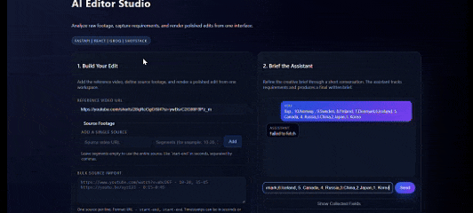
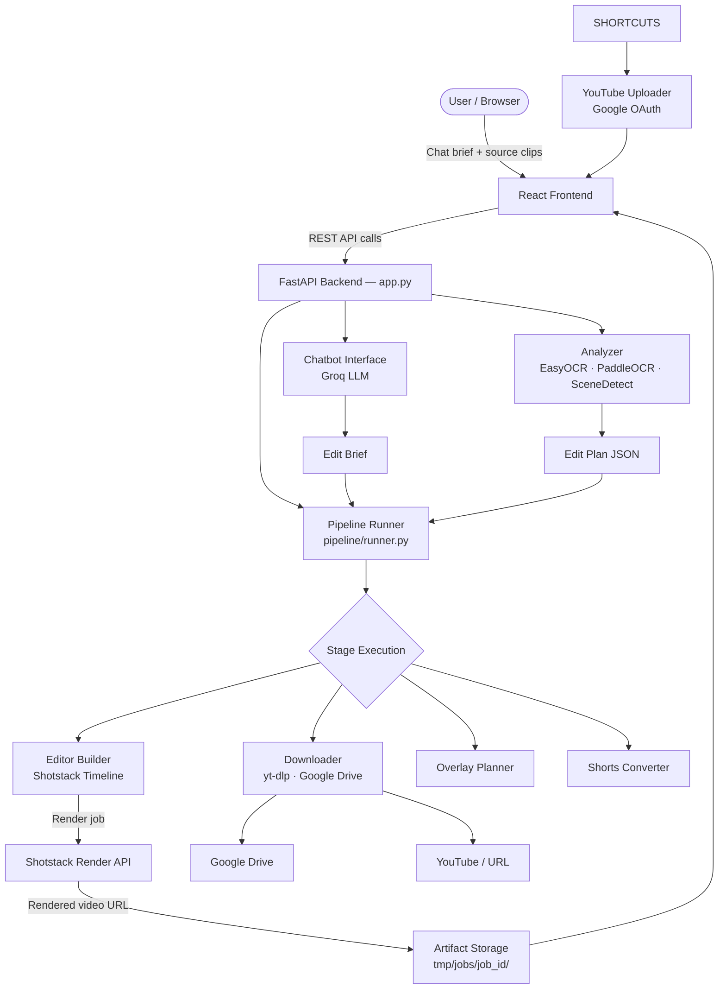
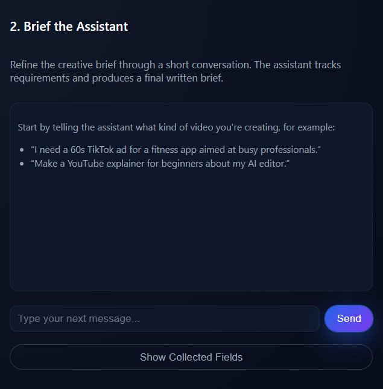
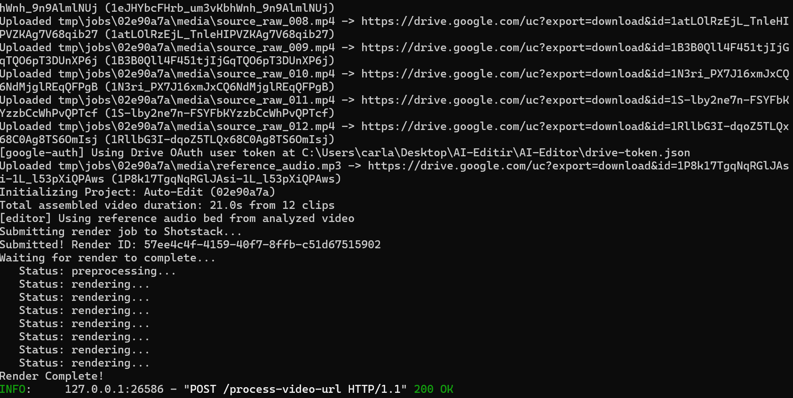
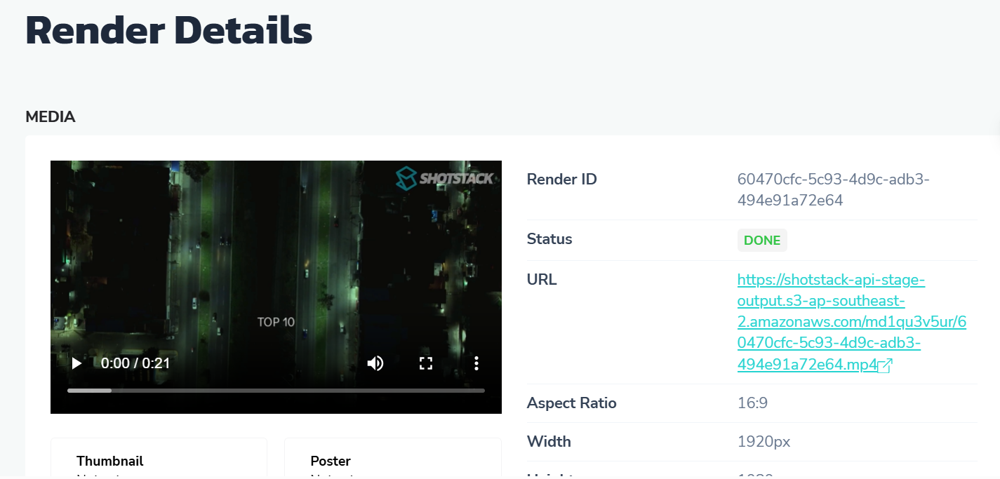

# AI Editor

> **AI-assisted video editing pipeline** — from reference analysis to rendered output, with full-stack orchestration, Shorts conversion, and one-click publishing.

[](https://www.python.org/)
[](https://fastapi.tiangolo.com/)
[](https://react.dev/)
[](https://shotstack.io/)
[](LICENSE)

---



---

## What It Does

AI Editor is a multi-stage media pipeline that accepts a *reference video* and a set of *source clips*, uses AI analysis to understand structure and style, builds a stage-based edit plan, renders a polished output via the Shotstack API, and optionally converts the result to a vertical Short and publishes to YouTube.

It is **not a simple wrapper** around an LLM. It integrates:
- computer-vision based video & scene analysis (EasyOCR, PaddleOCR, SceneDetect)
- AI-driven edit planning via Groq / conversational brief builder
- a structured multi-stage pipeline runner with per-job artifact storage
- a Shotstack rendering integration with timeline assembly logic
- a React frontend with job status tracking and Google Drive/YouTube OAuth

---

## Key Features

| Feature | Detail |
|---|---|
| 🎬 Reference video analysis | Scene detection, OCR extraction, structure parsing |
| 🤖 AI edit planning | Groq-powered conversational brief → structured edit plan |
| 🗂 Stage-based pipeline | Ordered stages with state persistence per job |
| 🎞 Shotstack rendering | Timeline assembly → cloud render → artifact storage |
| ✂️ Shorts conversion | 16:9 → 9:16 crop, reframe, and post-process |
| 📤 YouTube upload | OAuth 2.0 integration, metadata, direct publish |
| 🗄 Google Drive ingestion | Service-account or OAuth-based asset retrieval |
| 🧪 Unit tests | Coverage for normalization, overlay policy, text segments |

---

## Architecture



### Request Flow

1. **User submits a brief** via the React chat interface → Groq LLM refines it into a structured edit plan.
2. **Reference video is analyzed** — scenes are detected, text overlays are OCR-extracted, structure is mapped.
3. **Pipeline runner** executes ordered stages: asset download → edit assembly → overlay planning → render submission.
4. **Shotstack** renders the timeline; the backend polls for completion and stores the artifact.
5. **Optional post-processing** converts the render to a 9:16 Short and uploads to YouTube.

---

## Tech Stack

| Layer | Technology |
|---|---|
| Backend API | Python 3.10+, FastAPI, Uvicorn |
| AI / Analysis | EasyOCR, PaddleOCR, SceneDetect, OpenCV, Groq API |
| Edit Planning | Custom planner + LLM-assisted brief builder |
| Rendering | Shotstack SDK (cloud video rendering) |
| Asset Ingestion | yt-dlp, Google Drive API (service account + OAuth) |
| Export | YouTube Data API v3, Google Auth OAuthlib |
| Frontend | React + Vite |
| Tests | pytest |
| Containerization | Docker |

---

## Repository Structure

```
AI_Editor/
├── app.py                    # FastAPI entrypoint — all HTTP routes
├── Dockerfile                # Container build
├── requirements.txt          # Python dependencies
├── .env.example              # Environment variable reference
│
├── ai_editor/                # Core AI & media logic
│   ├── analyzer.py           # Scene detection, OCR, video analysis
│   ├── chatbot_interface.py  # Groq-powered brief builder
│   ├── downloader.py         # yt-dlp + Google Drive asset fetching
│   ├── editor.py             # Shotstack timeline assembly
│   ├── overlay_planner.py    # Text/graphic overlay scheduling
│   ├── youtube_clipper.py    # Clip extraction and trimming
│   ├── youtube_uploader.py   # YouTube OAuth upload flow
│   └── google_auth.py        # Google credential management
│
├── pipeline/                 # Orchestration layer
│   ├── runner.py             # Stage runner (main orchestrator — ~60 KB)
│   ├── state.py              # Per-job state machine
│   ├── artifacts.py          # Artifact path resolution and storage
│   ├── plans/                # Edit plan schemas and planners
│   └── storage/              # Job storage helpers
│
├── frontend/                 # React UI (Vite)
│
├── docs/                     # Documentation
│   ├── assets/               # Screenshots, demo GIF, architecture image
│   ├── API_EXAMPLES.md
│   ├── DEPLOYMENT.md
│   ├── PROJECT_STRUCTURE.md
│   ├── SETUP_GUIDE.md
│   ├── TROUBLESHOOTING.md
│   └── pipeline_state.md
│
└── tests/
    ├── test_editor_normalization.py
    ├── test_overlay_policy.py
    └── test_text_segments.py
```

---

## Quick Start

### Prerequisites

- Python 3.10+
- Node.js 18+
- A [Shotstack](https://shotstack.io/) API key (Stage key is free for development)
- Optionally: Google Cloud service account for Drive ingestion, Groq API key

### 1 — Clone and install

```bash
git clone https://github.com/CarlAmine/AI_Editor.git
cd AI_Editor
python -m venv .venv && source .venv/bin/activate  # Windows: .venv\Scripts\activate
pip install -r requirements.txt
```

### 2 — Configure environment

```bash
cp .env.example .env
# Edit .env with your API keys (see Configuration section below)
```

### 3 — Run the backend

```bash
python app.py
# API available at http://localhost:8000
# Docs at http://localhost:8000/docs
```

### 4 — Run the frontend

```bash
cd frontend
npm install
npm run dev
# UI available at http://localhost:5173
```

### Docker (optional)

```bash
docker build -t ai-editor .
docker run -p 8000:8000 --env-file .env ai-editor
```

---

## Configuration

All configuration is via environment variables. Copy `.env.example` to `.env` and fill in:

| Variable | Required | Description |
|---|---|---|
| `SHOTSTACK_KEY` | ✅ | Shotstack API key (Stage or Production) |
| `GROQ` | ✅ | Groq API key for conversational brief builder |
| `GOOGLE_APPLICATION_CREDENTIALS` | Optional | Path to service account JSON for Drive access |
| `VIDEO_FOLDER` | Optional | Google Drive folder ID for source assets |
| `MUSIC_URL` | Optional | Default background music track URL |
| `DEEPSEEK_KEY` | Optional | Reserved for future LLM integration |

See [docs/SETUP_GUIDE.md](docs/SETUP_GUIDE.md) for full configuration details.

---

## API Examples

The FastAPI backend exposes a REST API. Interactive docs are at `http://localhost:8000/docs`.

```bash
# Start a new edit job
curl -X POST http://localhost:8000/jobs \
  -H 'Content-Type: application/json' \
  -d '{"reference_url": "https://...", "brief": "60s highlight reel, energetic style"}'

# Poll job status
curl http://localhost:8000/jobs/{job_id}/status

# Get rendered artifact
curl http://localhost:8000/jobs/{job_id}/artifact
```

See [docs/API_EXAMPLES.md](docs/API_EXAMPLES.md) for full request/response examples.

---

## Screenshots

### Chat Interface


### Job Status


### Timeline Plan


### Render Flow


---

## Testing

```bash
# Run all tests
pytest tests/ -v

# Run a specific suite
pytest tests/test_editor_normalization.py -v
```

Test coverage:
- `test_editor_normalization.py` — timeline normalization and clip boundary logic
- `test_overlay_policy.py` — overlay scheduling and policy enforcement
- `test_text_segments.py` — text segment parsing and validation

---

## Technical Highlights

- **Multi-stage pipeline orchestration** — `pipeline/runner.py` coordinates ordered stages with state transitions, retry logic, and per-job artifact isolation.
- **AI-assisted edit planning** — Groq LLM powers the conversational brief builder; output is structured into a machine-readable edit plan JSON.
- **Scene-aware video analysis** — SceneDetect-based shot boundary detection combined with EasyOCR and PaddleOCR for text extraction from frames.
- **Shotstack timeline assembly** — `ai_editor/editor.py` programmatically constructs Shotstack render specs from clip lists, overlays, and timing metadata.
- **Overlay planning layer** — `overlay_planner.py` schedules text/graphic elements respecting duration constraints and scene boundaries.
- **Shorts conversion flow** — automatic 16:9 → 9:16 reframe and post-processing for vertical delivery.
- **Full-stack architecture** — FastAPI backend + React frontend, communicating over REST, with Docker support.
- **Google ecosystem integration** — OAuth 2.0 for YouTube upload, service account support for Drive ingestion.
- **Unit test coverage** — pytest suites covering normalization edge cases, overlay policy, and segment logic.

---

## Performance & Benchmarks

> 🚧 **Benchmarking section — to be populated with measured values.**

| Metric | Value | Notes |
|---|---|---|
| Average job duration | TODO | End-to-end, reference → rendered artifact |
| Shotstack render turnaround | TODO | Dependent on clip count and resolution |
| OCR extraction latency | TODO | Per frame, GPU vs CPU |
| Scene detection latency | TODO | Per minute of video |
| Shorts conversion time | TODO | Post-render |
| Pipeline success rate | TODO | Under normal load |
| Max supported video length | TODO | Tested input duration |

To contribute benchmark data, run the pipeline on representative inputs and open a PR updating this table.

---

## Limitations & Known Issues

- Shotstack rendering is asynchronous; long videos may require extended polling.
- PaddleOCR has a large install footprint; a lighter OCR backend is on the roadmap.
- Google Drive OAuth tokens require manual refresh in some environments.
- The frontend does not yet support drag-and-drop clip reordering.
- No built-in queue/worker system; concurrent jobs run in-process threads.

See [docs/TROUBLESHOOTING.md](docs/TROUBLESHOOTING.md) for workarounds.

---

## Roadmap

### Short-term
- [ ] Add structured logging and per-stage timing metrics
- [ ] Improve Shotstack polling with exponential back-off
- [ ] Add asset validation before pipeline start (format, duration, resolution checks)
- [ ] Expand test coverage to pipeline runner stages
- [ ] Add CI workflow (GitHub Actions)

### Medium-term
- [ ] Replace PaddleOCR with a lighter OCR backend option
- [ ] Richer timeline editing UI (drag-and-drop, waveform preview)
- [ ] Support additional rendering backends (Creatomate, Remotion)
- [ ] Smarter shot selection using visual similarity scoring
- [ ] Automated caption generation (Whisper integration)
- [ ] Task queue (Celery / RQ) for concurrent job isolation
- [ ] Collaboration features (shared job links, comment threads)

---

## Deployment

See [docs/DEPLOYMENT.md](docs/DEPLOYMENT.md) for full deployment instructions including:
- Docker-based local and server deployment
- Environment variable management
- Reverse proxy setup (nginx)
- Shotstack production key configuration

---

## Contributing

See [CONTRIBUTING.md](CONTRIBUTING.md) for development setup, coding conventions, and how to submit changes.

---

## License

MIT — see [LICENSE](LICENSE).
