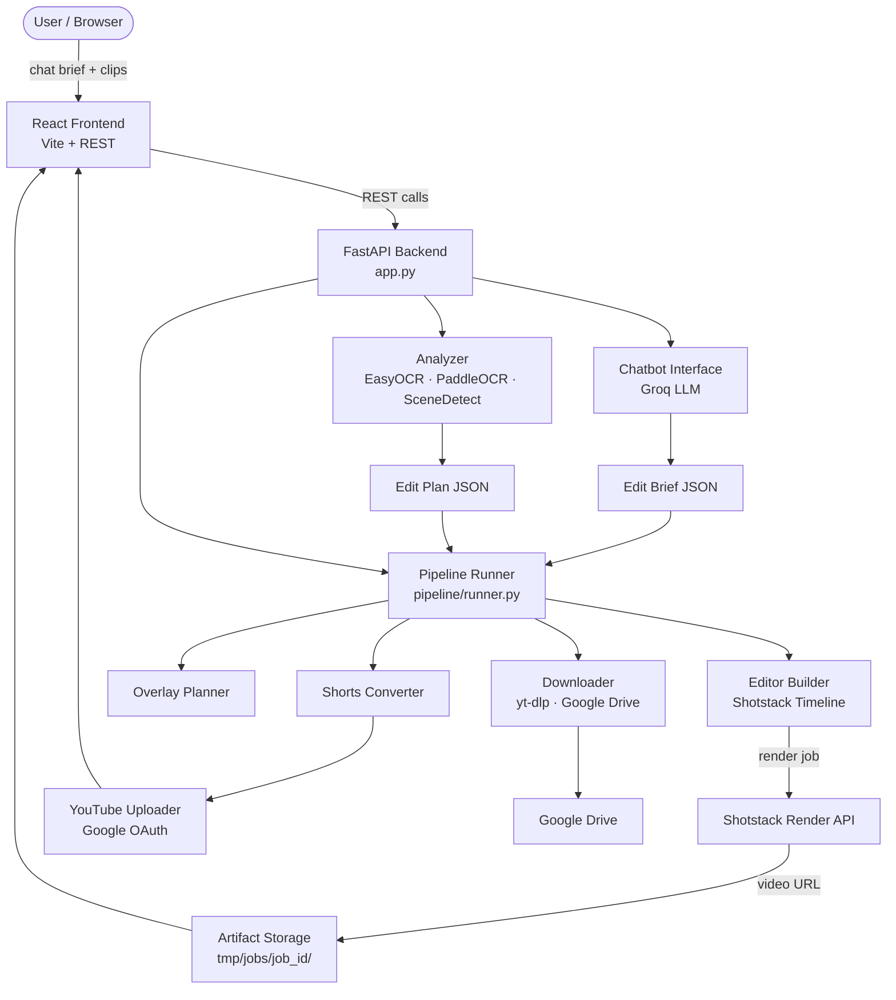

# Architecture

This document describes the system architecture of AI Editor.

## System Diagram

## Request Flow

1. **Brief submission** — The user types a natural language brief in the React chat interface. The Groq LLM refines it into a structured edit plan JSON.
2. **Video analysis** — The reference video is processed by the Analyzer: SceneDetect identifies shot boundaries, EasyOCR/PaddleOCR extract text from key frames.
3. **Pipeline execution** — The Pipeline Runner receives the edit plan and executes ordered stages: asset download, timeline assembly, overlay planning, render submission.
4. **Rendering** — The Editor Builder constructs a Shotstack render spec from clip metadata and timing data. Shotstack renders the timeline in the cloud and returns a video URL.
5. **Artifact storage** — All outputs (plans, logs, render URLs) are written to `tmp/jobs/<job_id>/` for per-job isolation.
6. **Export** — Optionally, the Shorts Converter reframes the output to 9:16 and the YouTube Uploader publishes it via Google OAuth.

## Module Responsibilities

| Module | File | Responsibility |
|---|---|---|
| API entrypoint | `app.py` | All HTTP routes, request validation |
| Analyzer | `ai_editor/analyzer.py` | Scene detection, OCR, frame analysis |
| Chatbot | `ai_editor/chatbot_interface.py` | LLM-powered brief refinement |
| Downloader | `ai_editor/downloader.py` | yt-dlp, Google Drive asset fetch |
| Editor | `ai_editor/editor.py` | Shotstack timeline construction |
| Overlay Planner | `ai_editor/overlay_planner.py` | Text/graphic element scheduling |
| YouTube Uploader | `ai_editor/youtube_uploader.py` | OAuth 2.0 publish flow |
| Pipeline Runner | `pipeline/runner.py` | Stage orchestration (~60 KB) |
| State | `pipeline/state.py` | Per-job state machine |
| Artifacts | `pipeline/artifacts.py` | Job artifact path resolution |
